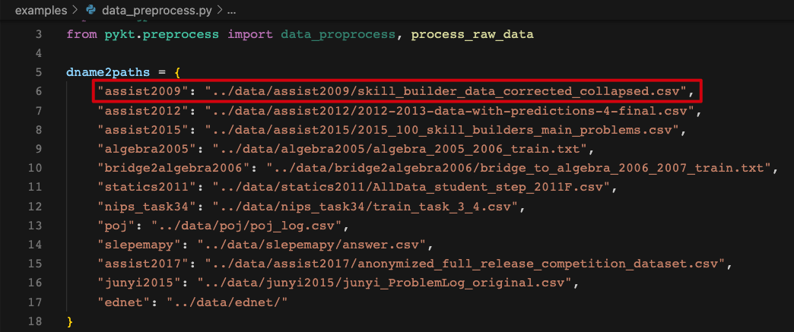
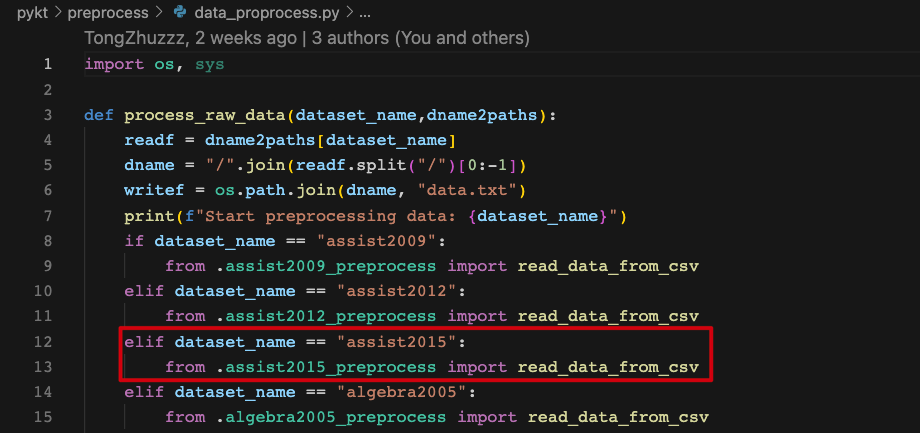
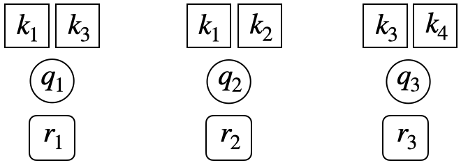
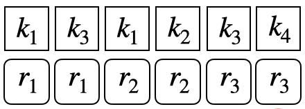
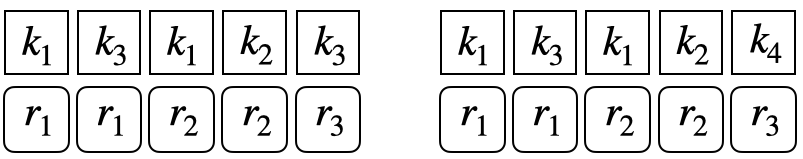
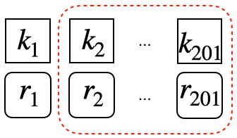

# How to contribute to pyKT?
pyKT is still under development. More KT models and datasets will be added, and we always welcome contributions to make pyKT better. 


## Guidance

Thank you for your interest in contributing to pyKT! You can make the following contributions to pyKT:
1. Bug-fix for an outstanding issue.
2. Add new datasets.
3. New model implementations.

### Install for Development

1、Fork the [pyKT](https://github.com/pykt-team/pykt-toolkit) by clicking the "Fork" button.

2、Clone the repository you cloned, and switch to the dev branch (Notice: Do not work on the main branch).

```shell
git clone https://github.com/{your github name}/pykt-toolkit
cd pykt-toolkit
git checkout dev
```

3、Editable Installation

You can use the following command to install the pyKT library. 

```shell
pip install -e .
```

In this way, every change made to the `pykt` directory will be effective immediately. The package does not require another installation again.

### Push Your Codes to pyKT (Pull Requests)
After implementing the new models or fixing bugs, you can push your codes to the dev branch in your repository. Then, you can use the merge request feature to merge your codes to pyKT's **main** branch.

The main branch is **not be allowed** to push codes (the push submission will be failed). And we will refuse the Pull Request from other branches to the main branch except for dev branch.

## Add Your Datasets

In this section, we will use the `ASSISTments2015` dataset as an example to show the adding dataset procedure. Here we simplify the  `ASSISTments2015` into `assist2015` as the dataset name, you can replace `assist2015` in your own dataset.

### Create Data Files
1、Please create a new dataset folder in the `data` directory with dataset name. 

```shell
mkdir -p ./data/assist2015
```

2、You should add the raw files of the new dataset into the named directory, like the file structure of `assist2015`:

```shell
$tree data/assist2015/
├── 2015_100_skill_builders_main_problems.csv
```

3、You need to provide the data path of new dataset to `dname2paths` of `examples/data_preprocess.py`.



### Data Preprocess File

1、Create the processing file `assist2015_preprocess.py` under the `pykt/preprocess` directory. The data preprocessing are suggested to follow the [Data Preprocess Guidelines](#Data Preprocess Guidelines). The main codes of the data preprocessing of `assist2015` are as follows:

```python
import pandas as pd
from pykt.utils import write_txt, change2timestamp, replace_text

def read_data_from_csv(read_file, write_file):
    # load the original data
    df = pd.read_table(read_file, encoding = "utf-8", dtype=str, low_memory=False)
    df["Problem Name"] = df["Problem Name"].apply(replace_text)
    df["Step Name"] = df["Step Name"].apply(replace_text)
    df["Questions"] = df.apply(lambda x:f"{x['Problem Name']}----{x['Step Name']}",axis=1)
    

    df["index"] = range(df.shape[0])
    df = df.dropna(subset=["Anon Student Id", "Questions", "KC(Default)", "First Transaction Time", "Correct First Attempt"])
    df = df[df["Correct First Attempt"].isin([str(0),str(1)])]#keep the interaction which response in [0,1]
    df = df[["index", "Anon Student Id", "Questions", "KC(Default)", "First Transaction Time", "Correct First Attempt"]]
    df["KC(Default)"] = df["KC(Default)"].apply(replace_text)

    data = []
    ui_df = df.groupby(['Anon Student Id'], sort=False)

    for ui in ui_df:
        u, curdf = ui[0], ui[1]
        curdf.loc[:, "First Transaction Time"] = curdf.loc[:, "First Transaction Time"].apply(lambda t: change2timestamp(t))
        curdf = curdf.sort_values(by=["First Transaction Time", "index"])
        curdf["First Transaction Time"] = curdf["First Transaction Time"].astype(str)

        seq_skills = [x.replace("~~", "_") for x in curdf["KC(Default)"].values]
        seq_ans = curdf["Correct First Attempt"].values
        seq_start_time = curdf["First Transaction Time"].values
        seq_problems = curdf["Questions"].values
        seq_len = len(seq_ans)
        seq_use_time = ["NA"]
        
        data.append(
            [[u, str(seq_len)], seq_problems, seq_skills, seq_ans, seq_start_time, seq_use_time])

    write_txt(write_file, data)
```
The entire codes can be seen in `pykt/preprocess/algebra2005_preprocess.py`.

2、Import the preprocess file to `pykt/preprocess/data_proprocess.py`.





### Data Preprocess Guidelines
#### Field Extraction

For each datset, we mainly extract 6 fields for model training: user ID, question ID (name), skill ID (name), answering results, answer submission time, and answering duration(if the field does not exist in the dataset, it is represented by "NA").

#### Data Filtering

The interaction with lacks one of the five fields in user ID, question ID (name), skill ID (name), answering results, answer submission time will be filtered out.

#### Data Ordering

A student's interaction sequence is order according to the answer submission time. The order will be kept consistent with the original relative position for different interactions with the same submission time.

#### Character Processing

- **Field concatenation:** Use `----` as the connecting symbol. For example, Algebra2005 needs to concatenate `Problem Name` and `Step Name` as the final problem name.
- **Character replacement:** If there is an underline `_` in the question and skill of original data, replace it with `####`. If there is a comma `,` in the question and skill of original data, replace it with `@@@@`.
- **Multi-skill separator:** If there are multiple skills in a question, we separate the skills with an underline `_`.
- **Time format:** The answer submission time is a millisecond (ms) timestamp, and the answering duration is in milliseconds (ms).

#### Output Data Format

After completing the above data preprocessing, you will get a data.txt file under the dataset namely folder(data directory). Each student sequence contains 6 rows informations as follows:

```
User ID, sequence length
Question ID (name)
skill ID (name)
Answer result
Answer submission time
Answering duration
```

Example:

```
50121, 4 
106101, 106102, 106103, 106104 
7014, 7012, 7014, 7013 
0, 1, 1, 1 
1647409594000, 1647409601000, 1647409666000, 1647409694000 
123, 234, 456, 789 
```
##### Testing Data Format
A question may be related to multiple knowledge concepts (KCs). To make the evaluation of pyKT consistent with the real-world prediction scenarios, we train DLKT models on KCs but evaluate them on questions level. To this end, the testing data has different formats in different prediction scenarios. To better understand, we use the below example to introduce various testing data formats. There are three questions $\{q_1,q_2,q_3\}$, each questions are related to two KCs $\{\{k_1,k_3\},\{k_1,k_2\},\{k_3,k_4\}\}$.


- **Repeat format:** Similar to training data and validation data, the original question-response sequences are expanded into KC level by repeating responses multiple times when a question has more than one KCs, one for each KC.

  
- **Question level format:** To conduct evaluation on the question level, we split the question-response sequence into KC-response subsequence. For example, for the question $q_3$ which is corresponding to the $\{k3,k4\}$. A KC-response subsequence is consist of all the historical interactions and the related KC information as follows:
  

- **Window format:** If a sequence has more than $M$ interactions, we set a sliding window to keep the sequence length is $M$. For instance, if $M=200$, the original sequence length is $201$, we select the interactions from $1$ to $201$ as final sequence:

  
  


## Add Your Models
### Create a New Model File
Our models are all in `pykt/models` directory. When you add a new model, please create a file named `{model_name}.py` in `pykt/models`. 
You can write your model file using "pykt/models/dkt.py" as a reference.

### Init Your Model
You need to add your model in `pykt/models/init_model.py` to init it by changing the `init_model` function.

### Add to the Training Process

1. You should change the `model_forward` and `cal_loss` function in `pykt/models/train_model.py` to add your model to the training process, you can refer to other models.

2. Run `wandb_train.py` to train the new model

### Add to the Evaluation Process
You can change the `evaluate_model.py` file, change the `evaluate` function to get the repeated knowledge concepts evaluation,  change the `evaluate_question` function to get the question evaluation results, change `predict_each_group` and `predict_each_group` to get the multi-step prediction results of accumulative and non-accumulative predictions.
