Models
======

Since the deep learning based KT models can be categorized into deep
sequential models, memory augmented models, adversarial based models,
graph based models and attention based models in our work, we mainly develop the DLKT models by these four categories in pyKT.

+------------+----------------+
| Models     | Category       |
+------------+----------------+
| DKT        | Sequential     |
+------------+----------------+
| DKT+       | Sequential     |
+------------+----------------+
| DKT-Forget | Sequential     |
+------------+----------------+
| KQN        | Sequential     |
+------------+----------------+
| DKVMN      | Memory         |
+------------+----------------+
| ATKT       | Adversarial    |
+------------+----------------+
| GKT        | Graph          |
+------------+----------------+
| SAINT      | Attention      |
+------------+----------------+
| SAKT       | Attention      |
+------------+----------------+
| AKT        | Attention      |
+------------+----------------+
| SKVMN      | Memory         |
+------------+----------------+
| HawkesKT   | Neural Network |
+------------+----------------+
| DeepIKT    | Memory         |
+------------+----------------+
| LPKT       | Sequential     |
+------------+----------------+
| DIMKT      | Sequential     |
+------------+----------------+
| IEKT       | Sequential     |
+------------+----------------+
| qDKT       | Sequential     |
+------------+----------------+
| AT-DKT     | Sequential     |
+------------+----------------+
| simpleKT   | Sequential     |
+------------+----------------+
| QIKT       | Sequential     |
+------------+----------------+
| sparseKT-soft | Attention  |
+------------+----------------+
| sparseKT-topK | Attention   |
+------------+----------------+
| RKT        | Attention      |
+------------+----------------+
| FoLiBiKT   | Attention      |
+------------+----------------+
|Dtransformer| Attention      |
+------------+----------------+

DKT
---

DKT is the first model that uses Recurrent Neural Networks (RNNs) to
solve Knowledge Tracing.

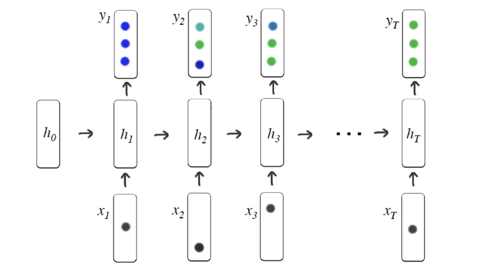

`Piech, Chris, et al. "Deep knowledge tracing." Advances in neural
information processing systems 28
(2015). <https://proceedings.neurips.cc/paper/2015/file/bac9162b47c56fc8a4d2a519803d51b3-Paper.pdf>`__

.. _dkt-2:

DKT+
----

DKT+ introduces regularization terms that correspond to reconstruction
and waviness to the loss function of the original DKT model to enhance
the consistency in KT prediction.

`Yeung, Chun-Kit, and Dit-Yan Yeung. "Addressing two problems in deep
knowledge tracing via prediction-consistent regularization." Proceedings
of the Fifth Annual ACM Conference on Learning at Scale.
2018. <https://arxiv.org/pdf/1806.02180>`__

DKT-Forget
----------

 DKT-Forget explores the deep knowledge tracing model by considering the
forgetting behavior via incorporate multiple forgetting information.

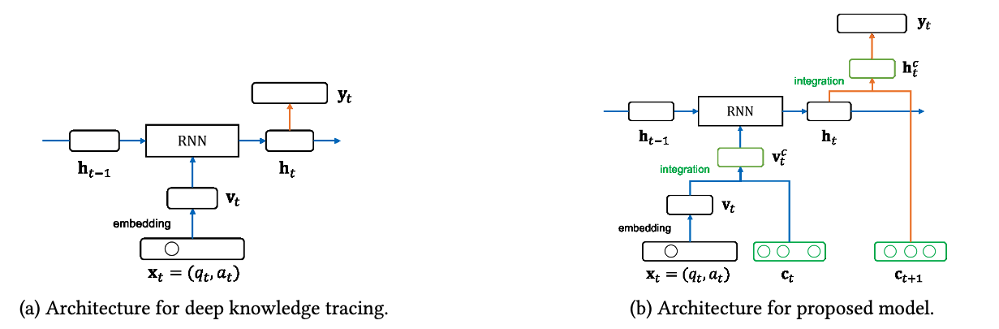

`Nagatani, Koki, et al. "Augmenting knowledge tracing by considering
forgetting behavior." The world wide web conference.
2019. <https://dl.acm.org/doi/10.1145/3308558.3313565>`__

.. _dkt-1:

KQN
---

KQN uses neural networks to encode student learning activities into
knowledge state and skill vectors, and calculate the relations between
the interactions via dot product.

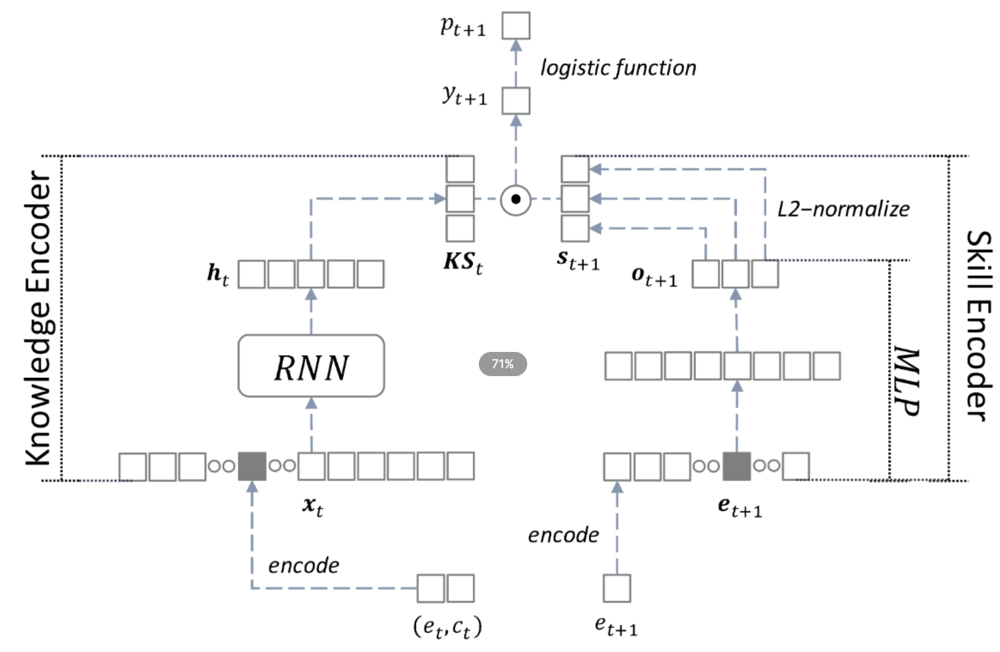

`Lee, Jinseok, and Dit-Yan Yeung. "Knowledge query network for knowledge
tracing: How knowledge interacts with skills." Proceedings of the 9th
international conference on learning analytics & Knowledge.
2019. <https://arxiv.org/pdf/1908.02146>`__

DKVMN 
------

Dynamic key-value memory networks (DKVMN) exploit the relationships
between latent KCs which are stored in a static memory matrix *key* and
predict the knowledge mastery level of a student directly based on a
dynamic memory matrix *value*.

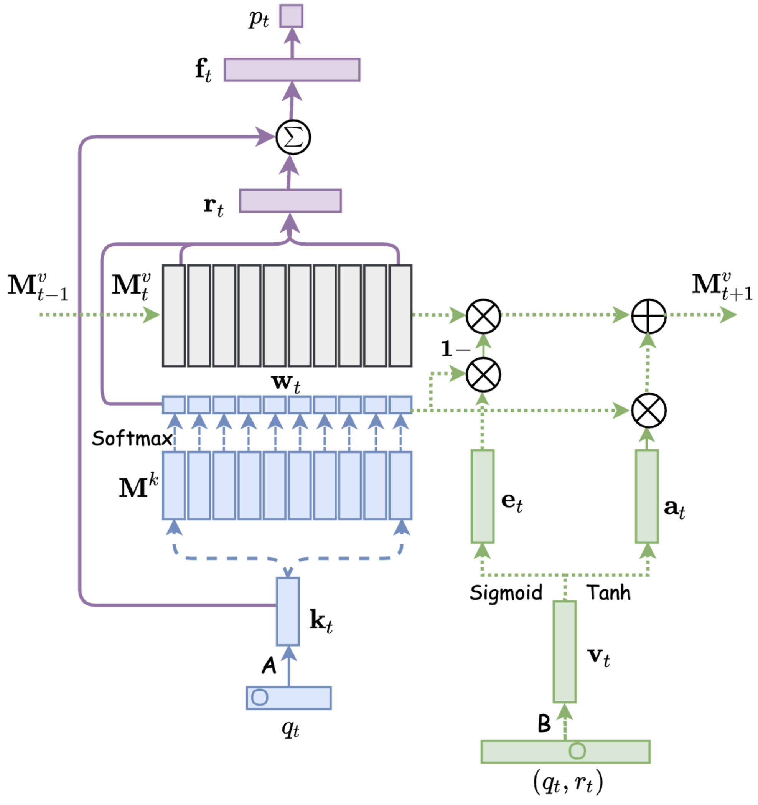

`Zhang, Jiani, et al. "Dynamic key-value memory networks for knowledge
tracing." Proceedings of the 26th international conference on World Wide
Web. 2017. <https://arxiv.org/abs/1611.08108>`__

ATKT
----

Adversarial training (AT) based KT method (ATKT) is an attention based
LSTM model which apply the adversarial perturbations into the original
student interaction sequence to reduce the the risk of DLKT overfitting
and limited generalization problem.

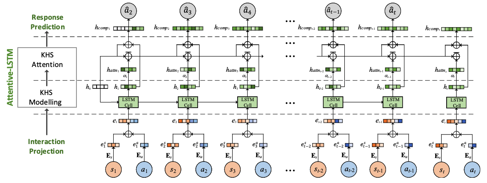

`Guo, Xiaopeng, et al. "Enhancing Knowledge Tracing via Adversarial
Training." Proceedings of the 29th ACM International Conference on
Multimedia. 2021. <https://arxiv.org/pdf/2108.04430>`__

GKT
---

Graph-based Knowledge Tracing (GKT) is a GNN-based knowledge tracing
method that use a graph to model the relations between knowledge
concepts to reformulate the KT task as a time-series node-level
classification problem.

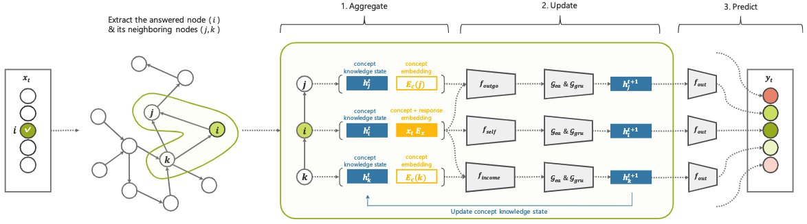

`Nakagawa, Hiromi, Yusuke Iwasawa, and Yutaka Matsuo. "Graph-based
knowledge tracing: modeling student proficiency using graph neural
network." 2019 IEEE/WIC/ACM International Conference On Web Intelligence
(WI). IEEE,
2019. <https://ieeexplore.ieee.org/abstract/document/8909656/>`__

SAKT
----

Self Attentive Knowledge Tracing (SAKT) use self-attention network to
capture the relevance between the KCs and the students' historical
interactions.

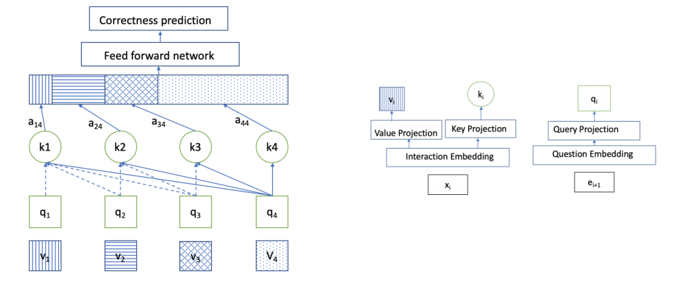

`Pandey, Shalini, and George Karypis. "A self-attentive model for
knowledge tracing." arXiv preprint arXiv:1907.06837
(2019). <https://arxiv.org/pdf/1907.06837.pdf>`__

SAINT
-----

Separated Self-AttentIve Neural Knowledge Tracing(SAINT) is a typical
Transformer based structure which embeds the exercises in encoder and
predict the responses in decoder.

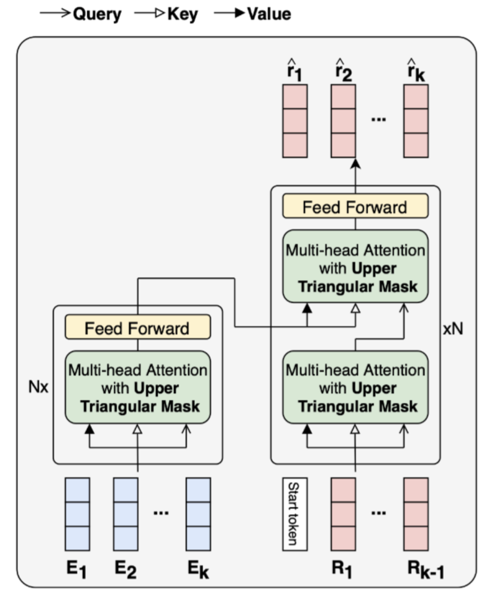

`Choi, Youngduck, et al. "Towards an appropriate query, key, and value
computation for knowledge tracing." Proceedings of the Seventh ACM
Conference on Learning@ Scale.
2020. <https://arxiv.org/pdf/2002.07033.pdf>`__

AKT
---
Attentive knowledge tracing (AKT) introduce a rasch model to
  regularize the KC and question embeddings to discriminate the
  questions on the same KC, and modeling the exercise representations
  and the students' historical interactdion embeddings via three
  self-attention based modules.

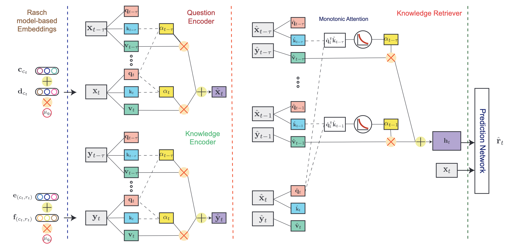

`Ghosh, Aritra, Neil Heffernan, and Andrew S. Lan. "Context-aware
attentive knowledge tracing." Proceedings of the 26th ACM SIGKDD
international conference on knowledge discovery & data mining.
2020. <https://dl.acm.org/doi/pdf/10.1145/3394486.3403282>`__

SKVMN
-----

This model unifies the strengths of recurrent modeling capacity and the
capability of memory networks to model the students' learning
precocesses.

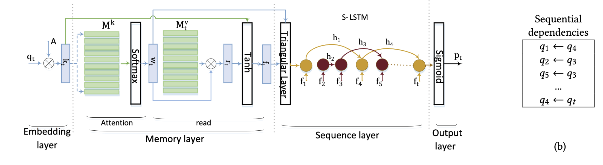

`Abdelrahman, Ghodai, and Qing Wang. "Knowledge tracing with sequential
key-value memory networks." Proceedings of the 42nd International ACM
SIGIR Conference on Research and Development in Information Retrieval.
2019. <https://arxiv.org/pdf/1910.13197.pdf>`__

HawkesKT
--------

HawkesKT is the first to introduce Hawkes process to model temporal cross effects in KT.

.. figure:: ../pics/hawkes.png
   :alt: 

`Wang, Chenyang, et al. "Temporal cross-effects in knowledge tracing."
Proceedings of the 14th ACM International Conference on Web Search and
Data Mining.
2021. <http://www.thuir.cn/group/~mzhang/publications/WSDM2021-WangChenyang.pdf>`__

Deep-IRT
--------

Deep-IRT is a synthesis of the item response theory (IRT) model and a
knowledge tracing model that is based on the deep neural network
architecture called dynamic key-value memory network (DKVMN) to make
deep learning based knowledge tracing explainable.

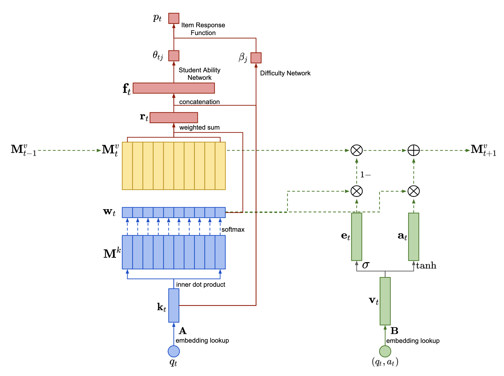

`Yeung, Chun-Kit. "Deep-IRT: Make deep learning based knowledge tracing
explainable using item response theory." arXiv preprint arXiv:1904.11738
(2019). <https://arxiv.org/pdf/1904.11738.pdf>`__

.. |image0| image:: pics/hawkes.png

LPKT
----

Learning Processconsistent Knowledge Tracing(LPKT) monitors students'
knowledge state by directly modeling their learning process.

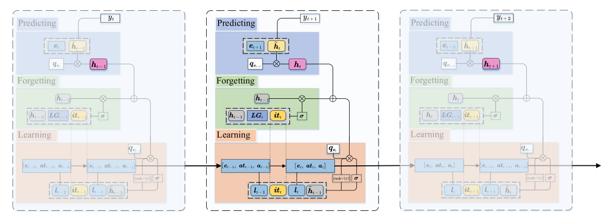

`Shen, Shuanghong, et al. "Learning process-consistent knowledge
tracing." Proceedings of the 27th ACM SIGKDD Conference on Knowledge
Discovery & Data Mining.
2021. <http://staff.ustc.edu.cn/~huangzhy/files/papers/ShuanghongShen-KDD2021.pdf>`__

DIMKT
----

The DIfficulty Matching Knowledge Tracing (DIMKT) model explicitly incorporate the difficulty level into the question representation 
and establish the relation between students' knowledge state and the question difficulty level during the practice process.

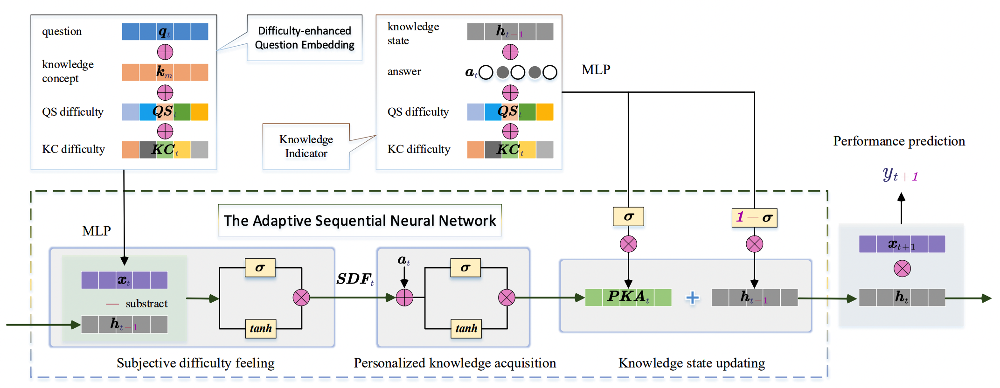

`Shen, Shuanghong, et al. "Assessing Student's Dynamic Knowledge State by Exploring the Question Difficulty Effect." 
Proceedings of the 45th International ACM SIGIR Conference on Research and Development in Information Retrieval. 
2022. <https://dl.acm.org/doi/pdf/10.1145/3477495.3531939>`__

IEKT
----

Individual Estimation Knowledge Tracing (IEKT) estimates the students'
cognition of the question before response prediction and assesses their
knowledge acquisition sensitivity on the questions before updating the
knowledge state.

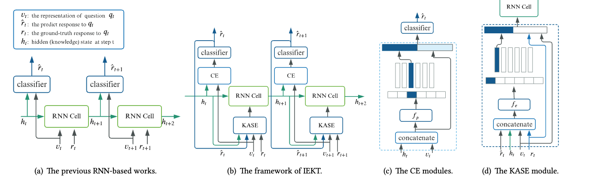

`Long, Ting, et al. "Tracing knowledge state with individual cognition
and acquisition estimation." Proceedings of the 44th International ACM
SIGIR Conference on Research and Development in Information Retrieval.
2021. <https://wnzhang.net/papers/2021-sigir-iekt.pdf>`__

qDKT
----

qDKT(base) is a model same as DKT, but use the question ID as the input.

`Sonkar, Shashank, et al. "qdkt: Question-centric deep knowledge
tracing." arXiv preprint arXiv:2005.12442
(2020). <https://arxiv.org/pdf/2005.12442.pdf>`__

AT-DKT
--------

AT-DKT improve the prediction performance of the original deep knowledge
tracing model with two auxiliary learning tasks including question
tagging prediction task and individualized prior knowledge prediction task.

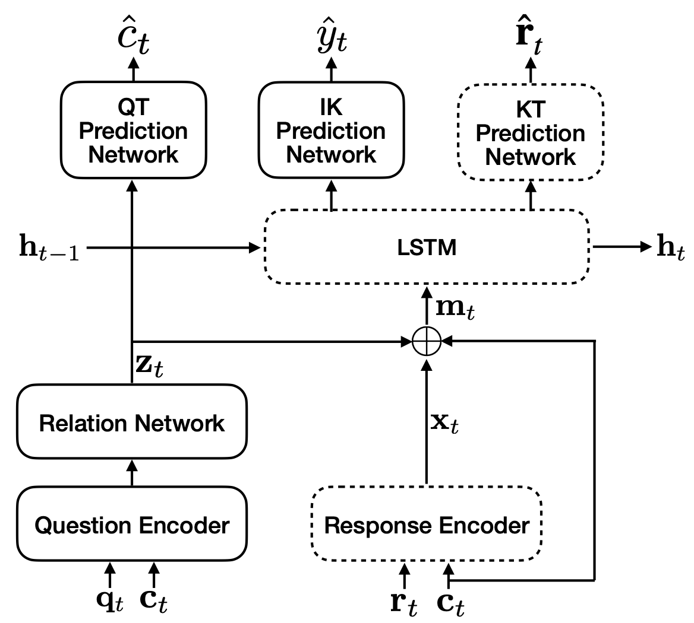

`Liu, Zitao, et al. "Enhancing deep knowledge tracing with auxiliary tasks."
Proceedings of the ACM Web Conference.
2023. <https://dl.acm.org/doi/pdf/10.1145/3543507.3583866>`__

simpleKT
----

simpleKT is a strong but simple baseline method to deal with the KT task by modeling question-specific variations based on Rasch model
and use the ordinary dot-product attention function to extract the time-aware information embedded in the student learning interactions.

`Liu, Zitao, et al. "simpleKT: A Simple But Tough-to-Beat Baseline for Knowledge Tracing." 
The Eleventh International Conference on Learning Representations. 
2022. <https://arxiv.org/pdf/2302.06881.pdf>`__

QIKT
----

QIKT is a question-centric interpretable KT model that estimates students' knowledge state variations 
at a fine-grained level with question-sensitive cognitive representations that are jointly learned from 
a question-centric knowledge acquisition module and a question-centric problem solving module. 

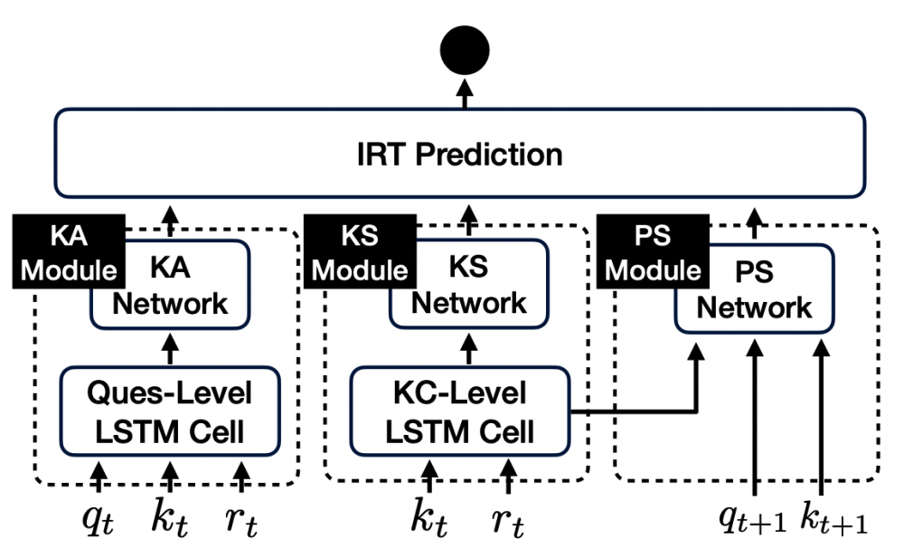

`Chen, Jiahao, et al. "Improving interpretability of deep sequential knowledge tracing models with question-centric cognitive 
representations." The 37th AAAI Conference on Artificial Intelligence.
2023. <https://arxiv.org/pdf/2302.06885.pdf>`__

sparseKT-soft/topK
----

sparseKT incorporate a k-selection module to only pick items with the highest attention scores including two sparsification heuristics: (1) soft-thresholding sparse attention (sparseKT-soft) and (2) top-𝐾 sparse attention (sparseKT-topK). 

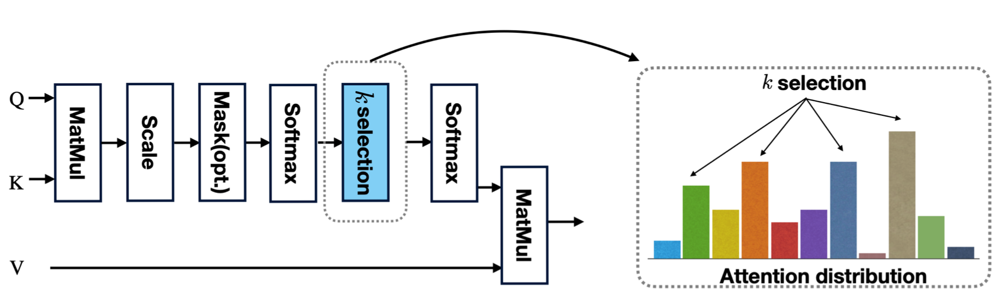

`Shuyan Huang, et al. "Towards Robust Knowledge Tracing Models via k-Sparse Attention." 
Proceedings of the 46th International ACM SIGIR Conference on Research and Development in Information Retrieval. 
2023.`

RKT
----

RKT contains a relation-aware self-attention layer that incorporates the contextual information including 
both the exercise relation information through their textual content as well as student performance data 
and the forget behavior information through modeling an exponentially decaying kernel function.

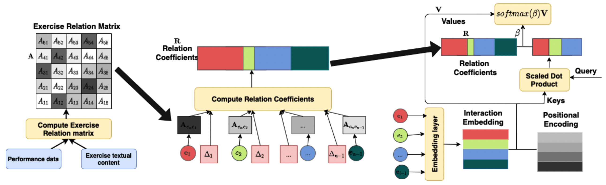

`Pandey, Shalini, and Jaideep Srivastava. "RKT: relation-aware self-attention for knowledge tracing." 
Proceedings of the 29th ACM International Conference on Information & Knowledge Management. 
2020. <https://dl.acm.org/doi/pdf/10.1145/3340531.3411994>`__

FoLiBiKT
----

FoLiBi (Forgetting-aware Linear Bias) is a simple yet effective solution that introduces a linear bias 
term to explicitly model learners' forgetting behavior, compensating for the neglect of forgetting effects 
in existing attention-based Knowledge Tracing models。We reproduced FoLiBi with AKT, namely FoLiBiKT. 

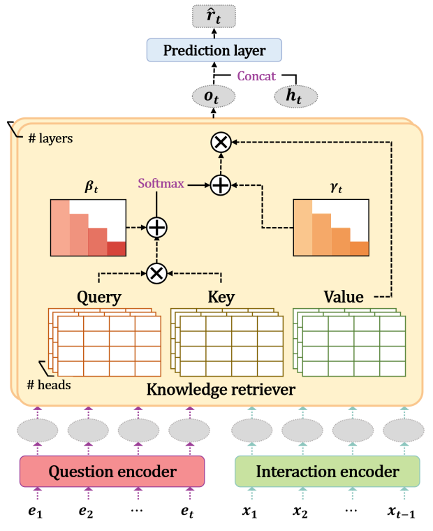

`Im, Yoonjin, et al. "Forgetting-aware Linear Bias for Attentive Knowledge Tracing." 
Proceedings of the 32nd ACM International Conference on Information and Knowledge Management. 
2023. <https://dl.acm.org/doi/abs/10.1145/3583780.3615191>`__

Dtransformer
----

The Diagnostic Transformer (DTransformer) integrates question-level mastery with knowledge-level diagnosis using 
Temporal and Cumulative Attention (TCA) and multi-head attention for dynamic knowledge tracing.   
Moreover, a contrastive learning-based training algorithm enhances the stability of knowledge state diagnosis.

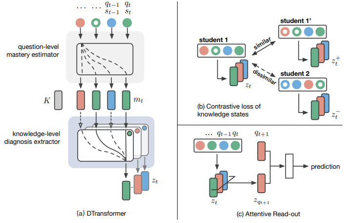

`Yin, Yu, et al. "Tracing Knowledge Instead of Patterns: Stable Knowledge Tracing with Diagnostic Transformer." 
Proceedings of the ACM Web Conference.
2023. <https://dl.acm.org/doi/pdf/10.1145/3543507.3583255>`__
