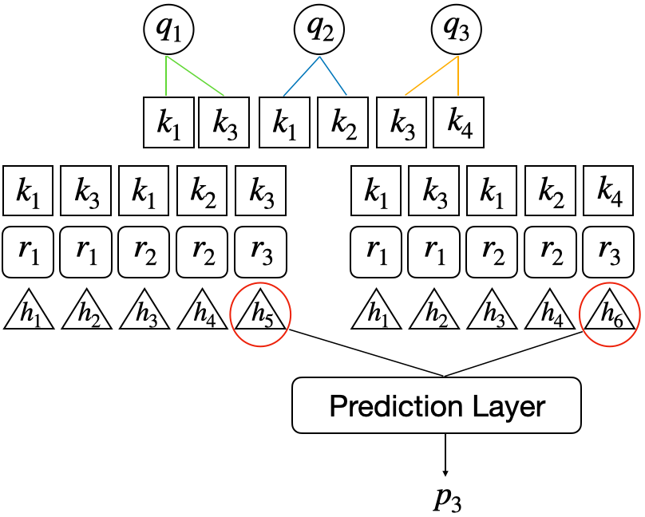
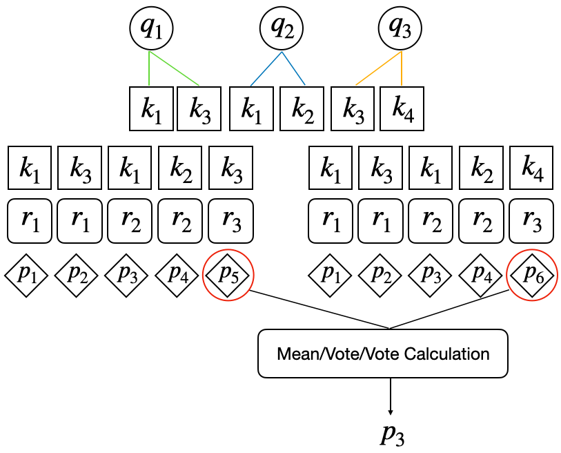
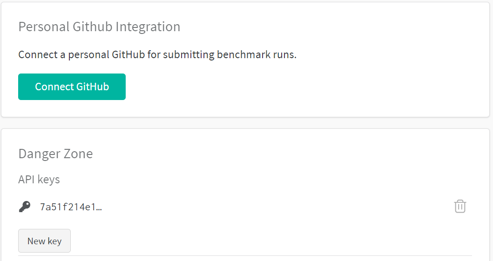
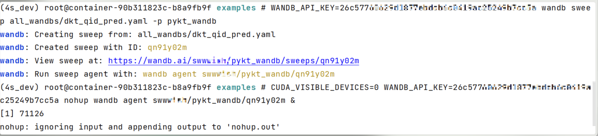

# Quick Start

## Installation
You can specify to install it through `pip`.

```shell
pip install -U pykt-toolkit
```

We advise to create a new Conda environment with the following command:

```shell
conda create --name=pykt python=3.7.5
source activate pykt
pip install -U pykt-toolkit
```

## Train Your First Model
### Prepare a Dataset
**1、Obtain a Dataset**

Let's start by downloading the dataset from [here](datasets.md). Please make sure you have creat the `data/{dataset_name}` folder
<!-- You can find the download link for a dataset from [here](datasets.md). Download the dataset to the `data/{dataset_name}` folder. -->

**2、Data Preprocessing**

`python data_preprocess.py [parameter]`

```shell
Args:
    --dataset_name: dataset name, default=“assist2015”
    --min_seq_len: minimum sequence length, default=3
    --maxlen: maximum sequence length, default=200
    --kfold: divided folds, default=5
```

Example:

```shell
cd examples
python data_preprocess.py --dataset_name=ednet
```

### Training a Model
After the data preprocessing, you can use the `python wandb_modelname_train.py [parameter]` to train a model:

```shell
CUDA_VISIBLE_DEVICES=2 nohup python wandb_sakt_train.py --dataset_name=assist2015 --use_wandb=0 --add_uuid=0 --num_attn_heads=2 > sakt_train.txt &
```

## Evaluating Your Model

Now, let's use `wandb_predict.py` to evaluate the model performance on the testing set.

`python wandb_predict.py`

```shell
Args:
    --bz: batch_size, default is 256
    --save_dir: the dictory of the trained model, default is "saved_model"
    --fusion_type: the fusion mode,default is "late_fusion"
    --use_wandb: use wandb or not, default is 1
```
### Evaluation Protocol
A question may be related to multiple knowledge concepts (KCs). To make the evaluation of pyKT is consistent with the real-world prediction scenarios, we train DLKT models on KCs but evaluate them on questions level as follows:

- **Early fusion:** Calculate the average of the hidden states on KC levels, and then input the average results into the prediction layer, hence get the prediction results on question level. For example, to obtain the prediction $p_3$ of $q_3$, we average the hidden states $h_5,h_6$ into the prediction layer.

  
- **Late fusion:** Employ three fusion types to obtain the question-level prediction based on the KC-level prediction results:(1) *Mean*: compute the average of the KC-level prediction results as the final prediction. (2) *Vote*: select half of the values of KC predictions as the final prediction. (3) *All*: only if all KC predictions are correct, the final prediction is correct, otherwise it is wrong.
  


 
## Hyperparameter Tuning

### Create a Wandb Account

We use Weights & Biases (Wandb) for hyperparameter tuning, it is a machine learning platform for developers to build better models faster with experiment tracking. Firstly, let's register an account in [Wandb](https://wandb.ai/) webpage to get the API key from [here](https://wandb.ai/settings):




Next, add your `uid` and `api_key` into `configs/wandb.json`.

### Sweep Configuration

`python generate_wandb.py [parameter]`

```shell
Args:
       --src_dir: The parameter configuration file path of the model
       --project_name: Project name on wandb, default: kt_toolkits
       --dataset_names: Dataset names, you can fill in multiple, separated by commas ",", default: "assist2015"
       --model_names: Model names, you can fill in multiple, separated by commas ",", default: dkt
       --folds: Default: "0,1,2,3,4"
       --save_dir_suffix: Add extra characters to the model storage path name, default: ""
       --all_dir: Generate the configuration file of the model for this dataset, default: "all_wandbs"
       --launch_file: Generated sweep startup script, default: "all_start.sh"
       --generate_all: The input is "True" or "False", indicating whether to generate the wandb startup files of all datasets and models in the all_dir directory (True means: generate the startup files of all data models in the all_dir directory, False means: only the current execution is generated data model startup file), default: "False"
```

### Start Sweep

**Step1**: `sh [launch_file] [parameter]`

```shell
sh [launch_file] > [Directed log] 2>&1
   
    - [launch_file]: required, the user submits the script of sweep to wandbs, and directs the execution output to [directed log])
    - [Directed log]: Required, execute the sweep in the log
```

Example:

```shell
python generate_wandb.py --dataset_names="assist2009,assist2015" --model_names="dkt,dkt+"
sh all_start.sh > log.all 2>&1
(You need to define the log file. )
```

**Step 2:** `sh run_all.sh [parameter]`

```shell
sh run_all.sh [Directed log] [start_sweep] [end_sweep] [dataset_name] [model_name] [gpu_ids] [project_name]

    - [Directed log]: Required, execute the sweep in the log
    - [start_sweep]: Required, the start id to start a sweep
    - [end_sweep]: Required, start sweep end id
    - [dataset_name]: Required, dataset name
    - [model_name]: Required, model name
    - [gpu_ids]: Required, GPU ID
    - [project_name]: optional, default: kt_toolkits
```

<!-- Execute run_all.sh, start sweep, read [directed log] here -->

Example:

```shell
sh run_all.sh log.all 0 5 assist2015 dkt 0,1,2,3,4
```

### Start Agents

```shell
sh start_sweep_0_5.sh
("0", "5" denote the start sweep and end sweep respectively.)
```
### Tuning Protocol

We use the Bayes search method to find the best hyperparameter, it is expensive to run all the hyperparameter combinations. Hence, you can run the `get_wandb_new` file to check whether to stop the searching. We default to stop the searching if the number of the tuned hyperparameter combinations in each data fold is larger than 300 and there is no AUC improvement on the testing data in the last 100 rounds (output "end!").

### Start Evaluation


Run the `get_wandb_new` file to generate the `{modal name}_{emb type}_pred.yaml` file, modify the program keyword in the YAML file, and change the model path to `./wandb_predict.py` or `wandb_predict.py`.

Then, execute the following command:

```shell
WANDB_API_KEY=xxx wandb sweep all_wandbs/dkt_qid_pred.yaml -p pykt_wandb 
#(xxx is your api_key, pykt_wandb is your wandb project name)

#e.g.,
CUDA_VISIBLE_DEVICES=0 WANDB_API_KEY=xxx nohup wandb agent swwwish/pykt_wandb/qn91y02m &
# qn91y02m is the agent name generated after the first command line is executed
```




There are only 5 sweeps to be run without any parameter tuning in this stage, with each sweep corresponding to the evaluation of each fold of the training data. Finally, you can export the evaluation results externally or call the wandb API for statistical 5- folds results, and calculate the mean and standard deviation of each metric, i.e., ***mean ± standard deviation***

If you want to add new models or datasets into pyKT, you can follow [Contribute](contribute.md).