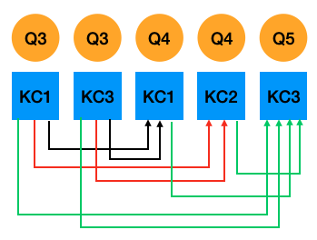

# pykt-toolkit

现有的知识追踪（Knowledge Tracing）工作中缺乏一个统一的数据划分标准，导致在各个知识追踪文献中，即便是相同的数据，由于划分方式不同，导致在相同的模型上也有不同的实验结果。因此，本工作旨在构建一个统一的数据预处理及划分结果，并在多个知识追踪SOTA上调优，供后续的知识追踪相关工作进行参考。

## 1. 生成训练数据
- cd preprocess
- python data_preprocess.py [参数]
```
   参数:
      --dataset_name:数据集名称，默认为“assist2015”
      --min_seq_len:最小序列长度，默认为3
      --maxlen:最大序列长度，默认为200
      --kfold:划分折数，默认为5
   
   示例
   cd preprocess
   python data_preprocess.py --dataset_name=assist2009
```
执行以上命令即可完成数据预处理和数据划分，生成训练所需数据格式。具体的数据集选取、预处理及划分方式如下:

### 1.1 数据集选取

目前，我们已对7个数据集进行了处理，如下所示

<!-- | 数据集              | 数据来源                                                                                                              | 文件名称                                    |
|:-------------------|:---------------------------------------------------------------------------------------------------------------------|:-------------------------------------------|
| ASSIST2009         | https://sites.google.com/site/assistmentsdata/home/2009-2010-assistment-data/skill-builder-data-2009-2010?authuser=0 | skill_builder_data_corrected_collapsed.csv |
| ASSIST2015         | https://sites.google.com/site/assistmentsdata/datasets/2015-assistments-skill-builder-data                           | 2015_100_skill_builders_main_problems.csv  |
| Algebra2005        | https://pslcdatashop.web.cmu.edu/KDDCup/downloads.jsp                                                                | algebra_2005_2006_train.txt                |
| Bridge_algebra2006 | https://pslcdatashop.web.cmu.edu/KDDCup/downloads.jsp                                                                | bridge_to_algebra_2006_2007_train.txt      |
| Statics2011        | https://pslcdatashop.web.cmu.edu/DatasetInfo?datasetId=507                                                           | AllData_student_step_2011F.csv             |
| NIPS2020 Task 3 & 4| https://www.microsoft.com/en-us/research/academic-program/diagnostic-questions/                                      | train_task_3_4.csv                         |
| POJ                | https://drive.google.com/drive/folders/1LRljqWfODwTYRMPw6wEJ_mMt1KZ4xBDk                                             | poj_log.csv                                | -->

### 1.2 数据预处理标准

每个数据集都对应一个数据预处理脚本: [数据集名称]_preprocess.py，处理标准如下:

#### 1.2.1 字段提取
对于任意一个数据集，我们主要提取用户ID、题目ID(名称)、知识点ID(名称)、答题情况、答案提交时间、答题用时6个字段（如数据集不存在该字段则用NA表示）。

#### 1.2.2 数据筛选
对于每条答题记录，如其用户ID、题目ID(名称)、知识点ID(名称)、答题情况、答案提交时间5个字段中任意字段为空，则该条答题记录予以删除。

#### 1.2.3 数据排序
每个学生答题序列都按照学生答题顺序进行排序，如同一学生的不同答题记录出现相同的顺序，则保持原始顺序，即与原数据集中的答题记录顺序保存一致。

#### 1.2.4 字符处理
- 字段拼接 

   以“----“作为连接符号。
   例如：Algebra2005需将Probelm Name 和 Step Name拼接作为题目名称。
- 字符替换

   如果原数据题目和知识点中存在下划线“_”，则替换为"####"。
   如果原数据题目和知识点中存在逗号“,”，则替换为"@@@@"。
-  多知识点分割符

   如果一个题目存在多个知识点，我们用下划线“_”分隔知识点。
-  时间格式

   答案提交时间为毫秒（ms）级时间戳，答题用时以毫秒（ms）为单位。
#### 1.2.5 输出数据格式
完成以上数据预处理工作后，每个数据集都会在以它命名的文件夹（data目录）下生成一个data.txt文件。每个学生序列包含6行数据，如下所示: 

```
用户ID，序列长度 
题目ID (名称) 
知识点ID (名称) 
答题情况 
答案提交时间 
答题用时 
```
示例
```
示例1：
50121, 4 
106101, 106102, 106103, 106104 
7014, 7012, 7014, 7013 
0, 1, 1, 1 
1647409594000, 1647409601000, 1647409666000, 1647409694000 
123, 234, 456, 789 
```
```
示例2：
83935, 8
NA
37876, 37876, 37876, 37876, 37876, 37876, 37876, 37876
1, 1, 0, 1, 0, 1, 1, 1
NA
NA
```

### 1.3 数据切分
```
./prepocess/split_datasets.py
```
#### 1.3.1 生成训练/验证/测试集
在整个数据集**随机抽取80%序列做为训练集，剩余20%为测试集**。同时，**将训练集根据80%训练集和20%验证集的比例划分为5折**。在5折划分时，如数据不能进行等分（即数据大小不能被5整除，存在余数），则**多余的序列从第一折开始逐个加入到每一折中**。

#### 1.3.2 一个题目多知识点处理
- 复制方式

   部分数据集存在一个题目对应多个知识点的情况。对于一个题目多知识点的交互，我们参考此前工作[<sup>1</sup>](#ref1)[<sup>2</sup>](#ref2)，我们**将一个学生的答题记录复制多次，每个知识点作为一次交互**，并用字段“is_repeat"标识（如交互是复制而成，则标识为1，反之为0）。同时，我们用一个“selectmasks”标识需要预测的题目。例如：./data/assist2009/train_valid_sequences.csv


   ```
   示例

   原始序列
   题目：3, 4, 5
   知识点：1_3, 1_2, 3
   答题情况：1, 0, 1

   复制方式
   题目：3, 3, 4, 4, 5
   知识点：1, 3, 1, 2, 3
   答题情况：1, 1, 0, 0, 1
   is_repeat: 0, 1, 0, 1, 0
   selectmasks: 1, 1, 1, 1, 1
   ```

-  基于题目预测的Fusion方式 (仅测试集)

   当一个题目对应多知识点时，在测试集采用复制方式会导致结果有所偏差(单个知识点当作一个题目，预测题量变多)。因此，我们尝试聚合一个题目对应的所有知识点预测结果作为该题的最终预测。
   
   为方便聚合一个题目所对应的所有知识点预测结果，我们生成基于题目预测生成的测试集文件时 (例如: ./data/assist2009/test_question_sequences.csv)，对于没有单个题目对应多知识点的序列，每一行是整个序列，预测所有知识点。而对于存在单题目对应多知识点的序列，我们将其分割成多个子序列，每个子序列占用一行，只预测其中一个知识点，而该知识点只参考其前面题目的所属知识点。如图1所示，题目4的知识点1和知识点2的预测都只参考题目3的知识点1和知识点3，题目5对应的知识点3则参考此前所有知识点。我们使用“qidx”字段标识每个知识点所属的题目在数据集中所属的全局位置，方便后续按照全局位置对知识点进行聚合; “rest”字段标识位于该知识点后面剩余的同属一道题的知识点个数,如为0则进行聚合, 否则不聚合。
   因此, 可生成如下子序列：

   示例
   


   图1：基于题目预测的Fusion方式
   </div> 


      ```
      >>>题目3的知识点1和知识点3预测题4的知识点1
      题目：3, 3, 4  
      知识点：1, 3, 1 
      答题情况：1, 1, 0
      selectmasks: -1, -1, 1
      is_repeat: 0, 1, 0
      qidxs: 0, 0, 1
      rest: 1, 0, 1

      >>>题目3的知识点1和知识点3预测题4的知识点2
      题目：3, 3, 4  
      知识点：1, 3, 2 
      答题情况：1, 1, 0 
      selectmasks: -1, -1, 1
      is_repeat: 0, 1, 1
      qidxs: 0, 0, 1
      rest: 1, 0, 0

      >>>题目3和题目4所有知识点预测题5的知识点3
      题目：3, 3, 4, 4, 5  
      知识点：1, 3, 1, 2, 3 
      答题情况：1, 1, 0, 0, 1
      selectmasks: -1, -1, -1, -1, 1
      is_repeat: 0, 1, 0, 1, 0 
      qidxs: 0, 0, 1, 1, 2
      rest: 1, 0, 1, 0, 0
      
   ```

   基于生成的序列，我们的有如下预测方式:

   (1) 聚合前:To do
   
   (2) early_fusion: 取该题对应的所有知识点的hidden state求平均，再输入到prediction模块

   (3) late fusion-mean: 对每个知识点的预测概率求平均，如果这个均值大于(等于)0.5，则视该题为答对

   (4) late fusion-vote: 该题对应的所有知识点预测结果超过(等于)半数视该题为答对

   (5) late fusion-all: 该题对应的所有知识点预测结果都为对，则该视该题为答对


#### 1.3.3 超出最大长度序列处理
   
   - 切分为子序列

   如果一个学生序列长度大于所设最大序列长度*M*，参照以往工作[<sup>2</sup>](#ref2)[<sup>3</sup>](#ref3)[<sup>4</sup>](#ref4)，我们将**整个序列分割为多个长度为*M*的短序列, 长度不足*M*用“-1”补齐**。例如：./data/assist2009/test_sequences.csv 和 ./data/assist2009/test_question_sequences.csv

   - 滑窗处理 (仅测试集)
   
   在测试集上直接采取以上两种方式会**遗失一定的历史信息从而影响预测结果**。因此我们额外对测试集进行了滑窗处理，即**对于长度大于*M*的序列，我们不做截断或分割处理，而是保留其前*M* - 1个答题历史**。例如，某个学生序列长度为205，最大序列长度为200，我们基于第1道题到第200道题预测第201道题；在预测第202道题时，保留第2到第201道题等等。在滑窗预测时，如果学生序列长度在*M*以内, 则全部预测, 如果学生的序列长度大于*M*, 由于前*M* - 1题在上一个序列中完成预测，为避免重复预测，我们生成的每条滑窗序列预测最后一题即可。例如：./data/assist2009/test_window_sequences.csv 和 ./data/assist2009/test_question_window_sequences.csv

### 1.4 添加新数据集
如果您想添加新的数据集，请在data目录下创建新的数据集文件夹，以其名称命名，将数据源文件存储在该目录之下，并在preprocess目录下参照我们的数据预测处理标准编写处理脚本[数据集名称]_preprocess.py，后在data_preprocess.py添加数据路径即可。

## 2. 模型调优
我们的调参在[Weights&Biases](https://wandb.ai/)  （Wandb）上进行。
### 2.1 配置Wandb Key
在Wandb完成个人注册并在configs/wandb.json中配置自己的uid和api_key

### 2.2 参数选取
参考原论文中各个超参的取值，我们设置每个超参的取值范围，编写参数配置文件。例如：seedwandb/dkt_merge_linear.yaml
### 2.3 调参步骤

- python generate_wandb.py [参数]
```
   参数:
      --src_dir:模型的参数配置文件路径
      --project_name:wandb上的项目名称, 默认值:kt_toolkits
      --dataset_names:数据集名称，可填多个，以逗号“,“分隔，默认值:“assist2015”
      --model_names:模型名称，可填多个，以逗号“,“分隔，默认值:dkt
      --folds:默认值:“0,1,2,3,4”
      --save_dir_suffix:给模型存储路径名称添加额外字符，默认值:“”
      --all_dir:生成该数据集该模型的配置文件，默认值:“all_wandbs”
      --launch_file:生成的sweep启动脚本，默认值:“all_start.sh”
      --generate_all:输入为“True“或“False”，表示是否生成all_dir目录下所有数据集和模型的wandb启动文件 (True表示:生成all_dir目录下所有数据模型的启动文件, False表示仅生成当前执行的数据模型的启动文件)，默认值:“False”
   
```
执行后会生成两个结果:
   ```
   目录all_dir：存放用于调参的配置文件
   launch_file文件：用于提交sweep的脚本（此处会读取wandb.json）
   ```

- sh [launch_file] [参数]
```
   sh [launch_file文件] > [定向日志] 2>&1
   
   - [launch_file文件]:必填，用户提交sweep到wandbs的脚本,将执行输出定向到[定向日志])
   - [定向日志]:必填，执行日志里的sweep
   
```
- sh run_all.sh [参数]
```
   sh run_all.sh [定向日志] [start_sweep] [end_sweep] [dataset_name] [model_name] [gpu_ids] [project_name]

   - [定向日志]:必填，执行日志里的sweep
   - [start_sweep]: 必填，启动sweep的起始id
   - [end_sweep]: 必填，启动sweep结束id
   - [dataset_name]:必填，数据集名称
   - [model_name]: 必填，模型名称
   - [gpu_ids]:必填，GPU ID
   - [project_name]:选填，默认值：kt_toolkits
   执行run_all.sh，启动sweep，此处读取[定向日志]
   
```

示例
```
   python generate_wandb.py --dataset_names="assist2009,assist2015" --model_names="dkt,dkt+"
   sh all_start.sh > log.all 2>&1
   sh run_all.sh log.all 0 5 assist2015 dkt 0,1,2,3,4
   sh start_sweep_0_5.sh
```
### 2.4 调参停止条件
- get_wandb.ipynb
```
   考虑到时间成本，我们无法穷举所有参数，需要设置调参停止条件。
   如模型已选取300组以上的参数组合，且最近运行的100组参数在测试集上都没取得最优结果，停止调参。
```

### 2.5 统计最优结果
每一折选取在验证集上取得最优AUC所对应的模型对测试集进行预测，
每一折有一个测试结果，把5个测试结果求平均即为模型预测结果。
- python merge_wandb_results.py [参数]
```
   参数:
      --src_dir:模型预测的参数配置文件路径
      --project_name:wandb项目名称，默认值:“kt_toolkits”
      --dataset_name:数据集名称，默认值:“assist2015”
      --model_names:模型名称，可填多个，以逗号“,“分隔,默认值:dkt
      --update:是否更新现有结果，默认值:“1 (是)”
      --save_dir:结果存储目录，默认值:“results”
      --extract_best_model:是否提取最优模型路径以便进行下文2.6中的Fusion预测，默认值:“False”
      --abs_dir:模型存储目录的绝对路径，默认值:“”
      --pred_dir:生成预测的配置文件，默认值:“pred_wandbs”
      --launch_file:生成的sweep启动脚本，默认值:"start_predict.sh”
      --generate_all:输入为“True“或“False”，表示是否生成pred_wandbs目录下所有数据集和模型的wandb启动文件 (True表示:生成pred_wandbs目录下所有数据模型的启动文件, False表示仅生成当前执行的数据模型的启动文件)，默认值:“False”
```
示例
```
   python merge_wandb_results.py --dataset_name=“assist2009” --model_names=“dkt,dkt+” --update="Fasle"
```

### 2.6 启动Wandb进行测试集上多知识点的Fusion预测
- 执行上文Section2.5统计最优结果中的命令python merge_wandb_results.py即可
- 执行上文Section2.3调参步骤中的命令sh [launch_file] [参数]
- 执行上文Section2.3调参步骤中的命令sh run_all.sh [参数]
- python extract_prediction_results.py [参数]
```
   python extract_prediction_results.py [数据集名称] [模型名称] [使用现有统计结果] [项目名称]

   - [数据集名称]:必填(可填多个数据集,以逗号“,“分隔)
   - [模型名称]:必填(可填多个模型,以逗号“,“分隔)
   - [使用现有统计结果]:必填（1:是，0:否）
   - [wandb项目名称]: 可选参数，默认值:“kt_toolkits”
   
   读取fusion预测结果
```

示例
```
   python merge_wandb_results.py --dataset_name="assist2009" --model_names="dkt,dkt+" --update="Fasle" --extract_best_model="True" --abs_dir="/data/huangshuyan/kt/kt_toolkits" --submit_all="False"
   sh start_predict.sh > predict.all 2>&1
   sh run_all.sh predict.all 0 1 assist2009 dkt,dkt+ 0
   sh start_sweep_0_1.sh
   python extract_prediction_results.py assist2009 dkt,dkt+ 1
```

## 参考

<div id="ref1"></div>

- [1] Piech，C.，Bassen，J.，Huang，J.，Ganguli，S.，Sahami，M.，Guibas，L. J.，& Sohl-Dickstein，J. (2015). [Deep knowledge tracing](https://proceedings.neurips.cc/paper/2015/file/bac9162b47c56fc8a4d2a519803d51b3-Paper.pdf). Advances in neural information processing systems，28. 

<div id="ref2"></div>

- [2] Zhang，J.，Shi，X.，King，I.，& Yeung，D. Y. (2017，April). [Dynamic key-value memory networks for knowledge tracing.](https://dl.acm.org/doi/pdf/10.1145/3038912.3052580) In Proceedings of the 26th international conference on World Wide Web (pp. 765-774).

<div id="ref3"></div>

- [3] Ghosh，A.，Heffernan，N.，& Lan，A. S. (2020，August). [Context-aware attentive knowledge tracing.](https://dl.acm.org/doi/pdf/10.1145/3394486.3403282) In Proceedings of the 26th ACM SIGKDD international conference on knowledge discovery & data mining (pp. 2330-2339).

<div id="ref4"></div>

- [4] Pandey，S.，& Srivastava，J. (2020，October). [Rkt: Relation-aware self-attention for knowledge tracing.](https://dl.acm.org/doi/pdf/10.1145/3340531.3411994) In Proceedings of the 29th ACM International Conference on Information & Knowledge Management (pp. 1205-1214).

<div id="ref5"></div>

- [5] Yeung，C. K.，& Yeung，D. Y. (2018，June). [Addressing two problems in deep knowledge tracing via prediction-consistent regularization.](https://arxiv.org/pdf/1806.02180.pdf) In Proceedings of the Fifth Annual ACM Conference on Learning at Scale (pp. 1-10).

- [6] Lee，J.，& Yeung，D. Y. (2019，March). [Knowledge query network for knowledge tracing: How knowledge interacts with skills.](https://arxiv.org/pdf/1908.02146.pdf)In Proceedings of the 9th International Conference on Learning Analytics & Knowledge (pp. 491-500). 

- [7] Abdelrahman, G., & Wang, Q. (2019, July). [Knowledge tracing with sequential key-value memory networks.](https://dl.acm.org/doi/pdf/10.1145/3331184.3331195) In Proceedings of the 42nd International ACM SIGIR Conference on Research and Development in Information Retrieval (pp. 175-184).

- [8] Pandey，S.，& Karypis，G. (2019). [A Self-Attentive Model for Knowledge Tracing.](https://arxiv.org/pdf/1907.06837.pdf) International Educational Data Mining Society.

- [9] Choi，Youngduck，et al. [Towards an appropriate query，key，and value computation for knowledge tracing.](https://dl.acm.org/doi/pdf/10.1145/3386527.3405945)Proceedings of the Seventh ACM Conference on Learning@ Scale. 2020.

- [10] Guo，X.，Huang，Z.，Gao，J.，Shang，M.，Shu，M.，& Sun，J. (2021，October). [Enhancing Knowledge Tracing via Adversarial Training.](https://dl.acm.org/doi/pdf/10.1145/3474085.3475554) In Proceedings of the 29th ACM International Conference on Multimedia (pp. 367-375).

- [11] Nagatani, K., Zhang, Q., Sato, M., Chen, Y. Y., Chen, F., & Ohkuma, T. (2019, May). [Augmenting knowledge tracing by considering forgetting behavior.](https://dl.acm.org/doi/pdf/10.1145/3308558.3313565) In The world wide web conference (pp. 3101-3107).

- [12] [knowledge-tracing-collection-pytorch](https://github.com/hcnoh/knowledge-tracing-collection-pytorch).

- [13] [Implementation of Context-Aware Attentive Knowledge Tracing (AKT)](https://github.com/arghosh/AKT).

- [14] [Implementation of Knowledge Tracing with Sequential Key-Value Memory Networks (SKVMN)](https://github.com/Badstu/CAKT_othermodels/tree/master/SKVMN).
- [15] [Implementation of Enhancing Knowledge Tracing via Adversarial Training (ATKT)](https://github.com/xiaopengguo/ATKT).